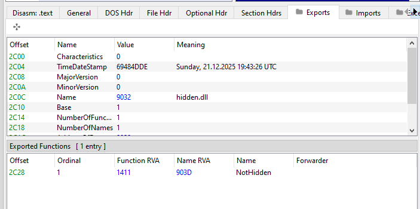
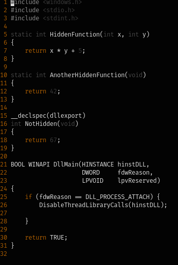
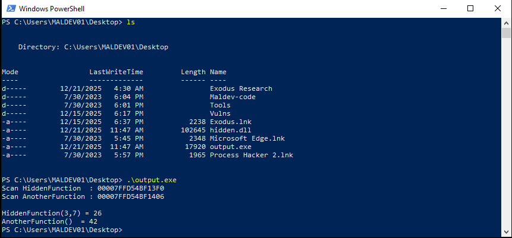

# PatternScanProc

## Description

**PatternScanProc** is a proof‑of‑concept project that demonstrates how to obtain a function pointer to a **non‑exported function** within a loaded module.

Typically, functions are resolved using `GetProcAddress` (or a custom equivalent) by name or ordinal, which only works for **exported symbols**. When a function is not exported, there is no direct way to retrieve its address using standard Windows APIs.

This project solves that limitation by extracting the **machine code bytes** of the target function and performing a **pattern scan** over the target module’s memory (`HMODULE`). Once the byte pattern is located, the resulting address can be used as a valid function pointer.

> **Note:**
> This project is intended as a **proof of concept**. Compiler optimizations, instruction padding, and code generation differences may affect reliability. Additional work is required to make this technique robust across different compilers, optimization levels, and build environments.

---

## Screenshots

### Export Table Verification

This image confirms that only the intended function is exported, while internal functions remain hidden.



---

### Hidden Function Implementation

Below is the implementation of the non‑exported functions whose instruction bytes are later used for pattern scanning.



---

### Runtime Pattern Scanning

This screenshot demonstrates the scanner successfully locating hidden functions in memory and resolving their addresses at runtime.



---

## Building

Ensure that **MinGW‑w64 (GCC)** is installed and available in your `PATH` before building.

```sh
cd src/testdll
make

cd ../scanner
make
```
